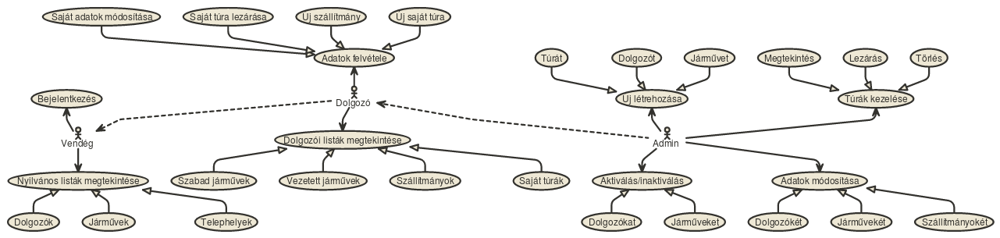
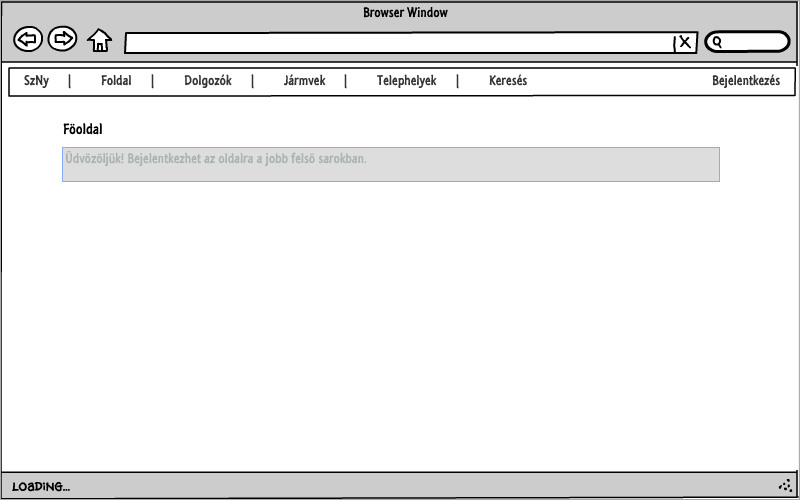
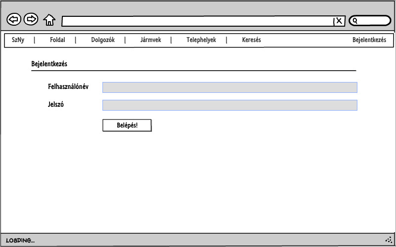
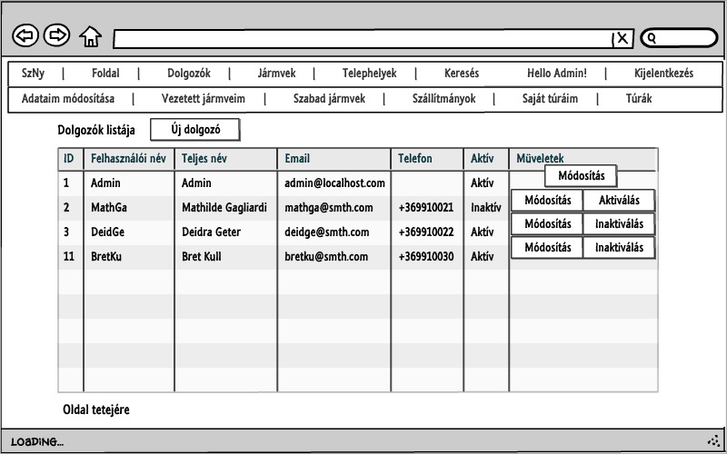
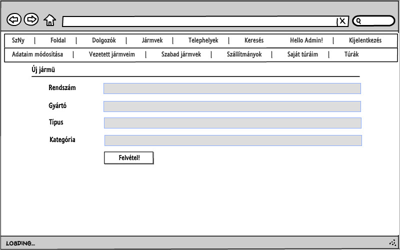
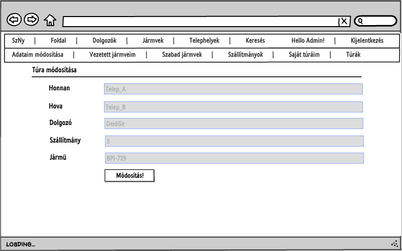
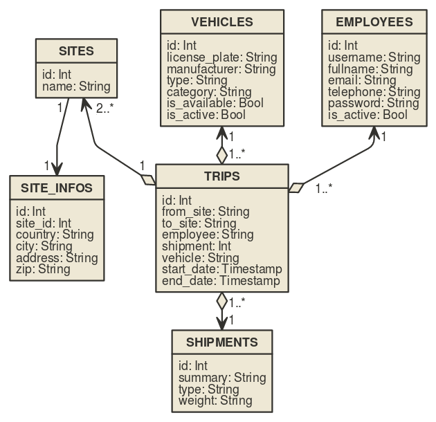
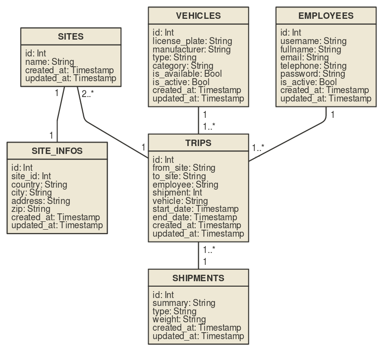
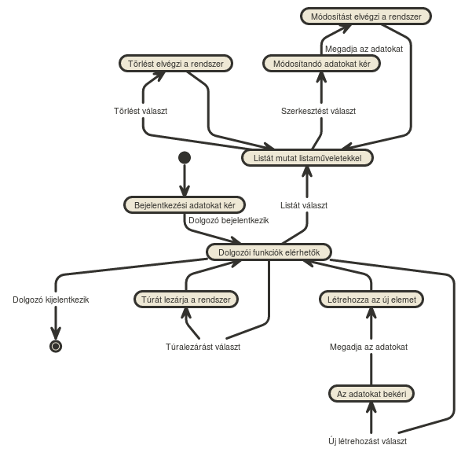

# Alkalmazások fejlesztése feladat dokumentációja
## Cég belső szállítmányozását nyilvántartó rendszer

### Tartalomjegyzék

1. Követelményanalízis
2. Tervezés
3. Implementáció
4. Tesztelés
5. Felhasználói dokumentáció
6. Felhasznált források
7. Változtatások a második beadandó részein
8. Kliensoldali fejlesztés

### 1. Követelményanalízis

#### 1.1. Célkitűzés

A cél olyan program létrehozása, mely egy cég belső szállítmányozását nyilvántartó alkalmazás leegyszerűsített változata. A dolgozók be tudjanak jelentkezni, tudják saját túráikat felvenni, lezárni; továbbá az ehhez szükséges adatok kezelésére (járművek, szállítmányok adatai, stb.) is legyen lehetőség egy admin felhasználó által.

#### 1.2. Követelmények összegyűjtése

##### 1.2.1. Funkcionális elvárások
- Guestként szeretném tudni kilistázni az összes dolgozót, járművet és telephelyet, adataikat megtekinteni.
- Employeeként szeretnék tudni bejelentkezni az oldalra.
- Employeeként szeretnék tudni kijelentkezni az oldalról.
- Employeeként szeretném tudni az adataimat módosítani.
- Employeeként szeretném tudni kilistázni az összes dolgozót, járművet és telephelyet, adataikat megtekinteni.
- Employeeként szeretnék tudni az általam eddig vezetett járművekre szűrt listát megtekinteni.
- Employeeként szeretnék tudni a jelenleg szabad járművekre szűrt listát megtekinteni.
- Employeeként szeretném tudni kilistázni az összes szállítmányt, adataikat megtekinteni.
- Employeeként szeretnék tudni létrehozni új szállítmányt.
- Employeeként szeretném tudni kilistázni a saját túráimat, adataikat megtekinteni.
- Employeeként szeretnék tudni létrehozni új saját túrát.
- Employeeként szeretném tudni saját megkezdett túrámat befejezni.
- Adminként szeretném tudni az Employee funkciókat használni.
- Adminként szeretnék tudni felhasználókat felvenni és aktívvá/inaktívvá tenni, adataikat módosítani.
- Adminként szeretnék tudni létrehozni új járművet.
- Adminként szeretném tudni a járművek adatait módosítani és járműveket aktívvá/inaktívvá tenni.
- Adminként szeretném tudni a nem befejezett túrákat törölni.
- Adminként szeretném tudni a szállítmányok adatait módosítani.

##### 1.2.2. Nem funkcionális elvárások
- Felhasználóbarát elrendezés és kinézet.
- Gyors működés.
- A rendszer az esetek legalább 90%-ában rendelkezésre áll.
- Biztonságos működés: jelszavak biztonságosan vannak tárolva, bizonyos funkciók csak megfelelő jogkörrel érhetők el. Hibásan bevitt adatok esetén a program jelezzen a felhasználónak az érintett mezőknél.

#### 1.3. Szakterületi fogalomjegyzék
- **Dolgozó (Employee):** a cég alkalmazottja, aki a szállítmányt elszállítja egyik telephelyről a másikra egy járművel. Employee ID-val, nicknévvel, teljes névvel, email címmel, telefonszámmal és jelszóval rendelkező objektum. Státusza lehet aktív vagy inaktív.
    * *Ha inaktív, nem lehet aktív túrája és nem éri el a dolgozói jogkörhöz tartozó funkciókat.*
    * *Csak akkor teheti az Admin inaktív állapotba, ha nincs befejezetlen túrája.*
- **Jármű (Vehicle):** a cég flottájába tartozó teherautó, melyet szállításra használnak. Vehicle ID-val, rendszámmal, gyártóval, típussal és kategóriával rendelkező objektum. Státusza egyrészt lehet aktív vagy inaktív, másrészt szabad vagy foglalt (utóbbi kettő csak aktív státusz esetén értelmezett).
    * *Ha szabad, új túrához kiválasztható a jármű.*
    * *Ha foglalt, épp egy folyamatban lévő túrát teljesít a jármű.*
    * *Inaktív állapotban a jármű nem használható. Inaktíválni csak akkor lehet a járművet, ha nem teljesít éppen túrát.*
- **Telephely (Site):** a cég telephelyei között történik a szállítás. Site ID-val, névvel, országgal, várossal, címmel és irányítószámmal rendelkező objektum.
- **Túra (Trip):** a szállítás adatait tartalmazza egy túra. Trip ID-val, induló- és céltelephellyel, dolgozóval, szállítmánnyal, járművel és időintervallummal rendelkező objektum.
    * *Ha a túra nem befejezett, van lehetőség törölni.*
    * *Túrához csak szabad és aktív jármű választható, mely a túra indításakor automatikusan foglalt és aktív státuszba kerül.*
    * *Egy dolgozónak egyszerre legfeljebb egy aktív túrája lehet.*
    * *Ha a túra teljesítésre került, le kell zárni. Ekkor a túrához kapcsolt jármű szabad státuszba kerül.*
- **Szállítmány (Shipment):** a szállítmány adatait, leírását tartalmazó egyed. Shipment ID-val, szöveges leírással, típussal és súllyal rendelkező objektum.
    * *Egy szállítmány objektumot több túrához is kiválaszthatnak, akár egyidőben is.*

#### 1.4. Használatieset-modell

##### 1.4.1. Szerepkörök

- **Guest:** az összes dolgozó, jármű és telephely adatait tartalmazó listák megtekintésére képes.
- **Employee:** a Guest jogaival rendelkezik, továbbá:
    * A főoldalon jelentést kap az aktuális túrájáról.
    * Új szállítmányt és saját túrát hozhat létre.
    * Módosíthatja saját dolgozói adatait.
    * Megtekinthet listát vezetett járműveiről, a szabad járművekről, a szállítmányokról és saját túráiról.
    * Lezárhatja saját aktív túráját.
- **Admin:** az Employee jogaival rendelkezik, továbbá:
    * Létrehozhat új túrát bármely dolgozó nevében.
    * Létrehozhat új dolgozót és új járművet.
    * Módosíthatja bármely dolgozó, jármű és szállítmány adatait.
    * Listát tekinthet meg az összes túráról.
    * Lezárhat aktív túrákat bármely dolgozó nevében.
    * Aktiválhatja/inaktiválhatja bármely dolgozót vagy járművet, amelyek eleget tesznek az aktiváláshoz/inaktiváláshoz szükséges kritériumoknak.
    * Törölhet olyan túrákat, amelyek még nincsenek lezárva.
    * A főoldalon jelentést kap az aktuális túrákról; arról, hogy melyik dolgozó mely járműveket vezette már; és arról, hogy melyik jármű mely túrákat teljesítette eddig.

##### 1.4.2. Használati eset diagram

##### 1.4.3. Egy folyamat részletezése: túra lezárása
1. A dolgozó az oldalon bejelentkezik.
2. Bejelentkezés után a főoldalon lenyitja az "Aktuális túra" fület.
3. Megnyomja a táblázat "Műveletek" oszlopában a "Befejezés" gombot.
4. A dolgozó az oldalról kijelentkezik.

### 2. Tervezés

#### 2.1. Architektúra terv
##### 2.1.1. Oldaltérkép
**Publikus:**
* Főoldal
* Dolgozók
* Járművek
* Telephelyek
* Névjegy
* Bejelentkezés

**Bejelentkezett aktív dolgozó:**
* Főoldal
    * "Új létrehozása" lenyíló blokk:
        * Új szállítmány létrehozása
        * Új saját túra létrehozása
* Dolgozók
    * Bejelentkezett dolgozó saját adatainak módosítása
* Járművek
* Telephelyek
* Adataim módosítása
* Vezetett járműveim
* Szabad járművek
* Szállítmányok
    * Új szállítmány
* Saját túráim
    * Új saját túra
    * Aktív túra befejezése
* Névjegy
* Kijelentkezés

**Bejelentkezett inaktív dolgozó:**
* Főoldal
* Dolgozók
    * Bejelentkezett dolgozó saját adatainak módosítása
* Járművek
* Telephelyek
* Adataim módosítása
* Vezetett járműveim (nem elérhető)
* Szabad járművek (nem elérhető)
* Szállítmányok (nem elérhető)
* Saját túráim (nem elérhető)
* Névjegy
* Kijelentkezés

**Bejelentkezett admin:**
* Főoldal
    * "Új létrehozása" lenyíló blokk:
        * Új szállítmány létrehozása
        * Új saját túra létrehozása
        * Új túra létrehozása
        * Új dolgozó létrehozása
        * Új jármű létrehozása
    * "Dolgozók által használt járművek" lenyíló blokk
    * "Járművek által teljesített túrák" lenyíló blokk
* Dolgozók
    * Új dolgozó
    * Dolgozók adatainak módosítása
    * Dolgozók aktiválása / inaktiválása
* Járművek
    * Új jármű
    * Járművek adatainak módosítása
    * Járművek aktiválása / inaktiválása
* Telephelyek
* Adataim módosítása
* Vezetett járműveim
    * Új jármű
* Szabad járművek
    * Új jármű
    * Járművek adatainak módosítása
    * Járművek inaktiválása
* Szállítmányok
    * Új szállítmány
    * Szállítmányok adatainak módosítása
* Saját túráim
    * Új saját túra
    * Aktív túra befejezése
    * Aktív túra törlése
* Túrák
    * Új túra
    * Aktív túra befejezése
    * Aktív túra törlése
* Névjegy
* Kijelentkezés

##### 2.1.2. Végpontok
* **GET/:** főoldal
* **GET/login:** bejelentkező oldal
* **POST/login:** bejelentkező adatok felküldése
* **GET/logout:** kijelentkező oldal
* **GET/about:** névjegy oldal
* **GET/list/employees:** dolgozólista oldal
* **GET/list/vehicles:** járműlista oldal
* **GET/list/vehicles/driven:** vezetett járműveket kilistázó oldal
* **GET/list/vehicles/free:** szabad járműveket kilistázó oldal
* **GET/list/shipments:** szállítmánylista oldal
* **GET/list/trips:**  túralista oldal
* **GET/list/trips/own:** saját túrákat kilistázó oldal
* **GET/list/sites:**  telephelylista oldal
* **GET/new/shipment:** új szállítmány felvétele
* **POST/new/shipment:** új szállítmány felvételéhez szükséges adatok felküldése
* **GET/new/trip:** új túra felvétele
* **POST/new/trip:** új túra felvételéhez szükséges adatok felküldése
* **GET/new/trip/own:** új saját túra felvétele
* **POST/new/trip/own:** új saját túra felvételéhez szükséges adatok felküldése
* **GET/new/employee:** új dolgozó felvétele
* **POST/new/employee:** új dolgozó felvételéhez szükséges adatok felküldése
* **GET/new/vehicle:** új jármű felvétele
* **POST/new/vehicle:** új jármű felvételéhez szükséges adatok felküldése
* **GET/edit/employee/id:** dolgozó adatainak módosítása
* **POST/edit/employee/id:** dolgozó adatainak módosítása, adatok felküldése
* **GET/edit/vehicle/id:** jármű adatainak módosítása
* **POST/edit/vehicle/id:** jármű adatainak módosítása, adatok felküldése
* **GET/edit/shipment/id:** szállítmány adatainak módosítása
* **POST/edit/shipment/id:** szállítmány adatainak módosítása, adatok felküldése
* **GET/activate/employee/id:** dolgozó aktiválása
* **GET/inactivate/employee/id:** dolgozó inaktiválása
* **GET/activate/vehicle/id:** jármű aktiválása
* **GET/inactivate/vehicle/id:** jármű inaktiválása
* **GET/close/trip/id:** túra lezárása
* **GET/delete/trip/id:** túra törlése

#### 2.2. Felhasználóifelület-modell
##### 2.2.1. Oldalvázlatok

#### 2.3. Osztálymodell
##### 2.3.1. Adatmodell

##### 2.3.2. Adatbázisterv

##### 2.3.3. Táblakapcsolatok típusaira példák
###### 2.3.3.1. EGY-EGY kapcsolat
* Telephelyek és adataik *(sites - site_infos)*

###### 2.3.3.2. EGY-SOK kapcsolat
* Járművek által teljesített túrák *(vehicles-trips)*

###### 2.3.3.3. SOK-SOK kapcsolat
* Dolgozók által vezetett járművek *(employees-trips-vehicles)*

##### 2.3.4. Állapotdiagram

### 3. Implementáció
#### 3.1. Fejlesztői környezet
* Az alkalmazás JavaScript nyelven, a Node.js környezetben az Adonis.js keretrendszerben íródik.
* A fejlesztés lokálisan történik a Visual Studio Code programmal.
* Az elkészült kód a Githubon is tárolásra kerül egy kódtárban.
    * A kódtár címe: https://github.com/tengex/alkfejl
    * `git add .` paranccsal az összes fájlt verzionáljuk
    * `git commit -am "<rövid leírás>"` paranccsal elfogadjuk a projektben történt módosításokat és megadjuk a commit leírását
    * `git push` paranccsal feltöltjük a kódtárba az előbb commitált verziót

#### 3.2. Könyvtárstruktúra
* **app**
    * **Commands**
        * *Greet.js*
    * **Http**
        * *kernel.js*
        * *routes.js*
    * **Http/Controllers**
        * *ActivateController.js*
        * *AuthController.js*
        * *CloseTripController.js*
        * *CreateNewController.js*
        * *DeleteController.js*
        * *EditController.js*
        * *IndexController.js*
        * *ListController.js*
    * **Listeners**
        * *Http.js*
    * **Model**
        * *Employee.js*
        * *Shipment.js*
        * *Site.js*
        * *Token.js*
        * *Trip.js*
        * *Vehicle.js*
* **bootstrap**
    * *app.js*
    * *events.js*
    * *extend.js*
    * *http.js*
    * *kernel.js*
* **config**
    * *app.js*
    * *auth.js*
    * *bodyParser.js*
    * *cors.js*
    * *database.js*
    * *event.js*
    * *session.js*
    * *shield.js*
* **database**
    * **migrations**
        * *1472478539755_Token.js*
        * *1479658110340_employees.js*
        * *1479664748484_vehicles.js*
        * *1479664758820_sites.js*
        * *1479664767020_trips.js*
        * *1479664776903_shipments.js*
        * *1480200915169_site_infos.js*
    * **seeds**
        * *Database.js*
        * *Employee.js*
        * *Shipment.js*
        * *Site.js*
        * *SiteInfo.js*
        * *Trip.js*
        * *Vehicle.js*
    * *development.sqlite*
    * *factory.js*
* **docs**
    * **images**: a dokumentációban szereplő képek
* **node_modules:** Node modulok
* **public**
    * **downloaded:** letöltött anyagok gyorsabb működés érdekében
        * *bootstrap.min.css*
        * *jquery-3.1.1.min.js*
        * *validator.min.js*
    * *createShipment.js*
    * *delete-close-activate.js*
    * *login.js*
    * *style.css*
    * *suggest.js*
* **resources**
    * **views**
        * *about.njk*
        * *edit.njk*
        * *index.njk*
        * *list.njk*
        * *loginForm.njk*
        * *master.njk*
        * *new.njk*
    * **views/errors**
        * *index.njk*
        * *permissionError.njk*
        * *unexpectedError.njk*
* **test**
    * **01_alap_tesztsor:** az 1-es tesztsor teszteseteinek fájljai
    * **02_jogosultsag_tesztsor:** a 2-es tesztsor teszteseteinek fájljai
    * **03_folyamat_aktivJS_tesztsor:** a 3-as tesztsor teszteseteinek fájljai
    * *01_alap_tesztsor.html*
    * *02_jogosultsag_tesztsor.html*
    * *03_folyamat_aktivJS_tesztsor.html*
* *ace*
* *CHANGELOG.md*
* *notes.md*
* *npm-shrinkwrap.json*
* *package.json*
* *README.md*
* *server.js*

### 4. Tesztelés

#### 4.1. Minta bejelentkezési adatok kézi teszteléshez

##### 4.1.1. Admin bejelentkezés
- **Felhasználónév:** `Admin`
- **Jelszó:** `admin`

##### 4.1.2. Bejelentkezés a többi dolgozóval
- **Felhasználónév:** a dolgozó felhasználóneve
- **Jelszó:** `pw`

#### 4.2. Tesztesetek
* Employee
    * Dolgozó létrehozása
    * Dolgozó szerkesztése
    * Dolgozó aktiválása/inaktiválása
    * Bejelentkezés jó és rossz jelszóval
    * Csak azokat az oldalakat láthassa, amihez van joga
    * Csak azokat a funkciókat használhassa, amihez van joga
* Vehicle
    * Jármű létrehozása
    * Jármű szerkesztése
    * Jármű aktiválása/inaktiválása
* Shipment
    * Szállítmány létrehozása
    * Szállítmány szerkesztése
* Túra
    * Túra létrehozása dolgozó és admin által
    * Túra lezárása dolgozó és admin által
    * Túra törlése admin által
* Listaoldalak
    * Az adatok megfelelően jelennek meg a táblázatokban
    * A funkciók eléréséhez megjelennek a gombok a megfelelő helyeken
* Főoldal
    * A statisztikai információk jól jelennek meg
        * Dolgozók által használt járművek
        * Járművek által teljesített túrák

#### 4.3. Automatizált tesztelés
Az alkalmazás automatizált tesztelését a Firefoxhoz elérhető Selenium IDE nevű pluginnal végezzük!
Az automatizált tesztekeket tartalmazó fájlok megtalálhatók a *"test"* mappában!

##### 4.3.1. Automatizált tesztek fájljai
###### 4.3.1.1. A *"test"* mappában a következő fájlok találhatók:
* *01_alap_tesztsor.html*
* *02_jogosultsag_tesztsor.html*
* *03_folyamat_aktivJS_tesztsor.html*

Ezek mindegyike egy-egy tesztsort tartalmaz, a teszteseteket az almappákból töltik be!

###### 4.3.1.2. A *"test"* mappában a következő mappák találhatók:
* *01_alap_tesztsor*
* *02_jogosultsag_tesztsor*
* *03_folyamat_aktivJS_tesztsor*

Ezek tartalmazzák az egyes tesztsorokhoz tartozó tesztesetek fájljait.

##### 4.3.2. Selenium IDE telepítése
A plugin a következő oldalon telepíthető: https://addons.mozilla.org/hu/firefox/addon/selenium-ide/

##### 4.3.3. Selenium IDE használata
1. A Selenium IDE megnyitása után az *"Open Test Suite"* menüponttal be kell tölteni egy tesztsort!
2. Az ablak baloldalán a *"Test Case"* panelben fel vannak sorolva a tesztsort alkotó tesztesetek. Dupla kattintással lehet másik tesztesetre váltani!
3. A Base URL mező értéke legyen az alkalmazás URL-jére beállítva! (http://localhost:3333/)
4. A tesztelés sebességét a Base URL mező alatti csúszkával lehet állítani! A tesztekben el vannak helyezve 1-2 másodperces várakozások a szükséges helyeken, így elvileg a leggyorsabb sebességre állítva is le kell futniuk rendesen a teszteknek!
5. A *"test"* mappában található összes tesztsor első *("a" betűjelzésű)* tesztesete tartalmaz **a tesztsorra vonatkozó megjegyzéseket**. Ezeket **be kell tartani**, mivel *az elkészített alkalmazás tartalmaz olyan tesztelendő funkciókat, amelyek az adatbázison csak kézi beavatkozással visszafordítható változtatásokat hajtanak végre!*
6. A *"Play entire test suite"* gomb megnyomásával az egész tesztsor lefut, a tesztesetek a panelen látható sorrendben hajtódnak végre.
7. A *"Play current test case"* gomb megnyomásával csak a kiválasztott teszteset futtatódik le.

##### 4.3.4. Az adatbázis alaphelyzetbe állítása teszteléshez
A tesztsorok futtatása előtt az adatbázist alaphelyzetbe kell állítani a következő parancssorozattal:

`./ace migration:refresh; ./ace db:seed;`

##### 4.3.5. A tesztsorok jellemzői
1. **Alap tesztsor** *(01_alap_tesztsor.html)*
    * Az adatmegjelenítő oldalakat teszteli.
    * *Futtatása előtt az adatbázist alaphelyzetbe kell állítani!*
    * Nem változtat az adatbázis tartalmán, így többször is lefuttatható egymás után az adatbázis alaphelyzetbe állítása nélkül.
    * A tesztesetek (`1a`, `1b`) futtatási sorrendje mindegy.

2. **Jogosultság tesztsor** *(02_jogosultsag_tesztsor.html)*
    * Az alkalmazásban bevezetett négy jogkör jogosultságait teszteli.
    * *Futtatása előtt az adatbázist alaphelyzetbe kell állítani!*
    * Változtat az adatbázis tartalmán.
    * A négy teszteset a tesztelés közben módosított adatokra épül, így a **következő sorrendben kell őket futtatni**: `2a`, `2b`, `2c`, `2d`!

3. **Folyamatok aktív Javascripttel tesztsor** *(03_folyamat_aktivJS_tesztsor.html)*
    * Funkcionális felületi teszteket tartalmaz.
    * 4 folyamatot tesztel le *(Dolgozók, Járművek, Szállítmányok, Túrák kezelése)*.
    * *Futtatása előtt az adatbázist alaphelyzetbe kell állítani!*
    * Változtat az adatbázis tartalmán.
    * A tesztesetek (`3a`, `3b`, `3c`, `3d`) futtatási sorrendje mindegy, de mindegyik legfeljebb egyszer futtatható helyesen az adatbázis újbóli alaphelyzetbe állítása nélkül!

### 5. Felhasználói dokumentáció
#### 5.1. Ajánlott hardver-, szerverkonfiguráció
- **Futtatáshoz szükséges operációs rendszer:** tetszőleges operációs rendszer.
- **A futtatáshoz szükséges hardver:** Operációs rendszerek szerint megadva
- **Egyéb követelmények:** internet böngésző telepítése, JavaScript ajánlott

#### 5.2. Telepítés
Az alkalmazás felhasználói telepítést nem igényel. Szerveroldali telepítéshez a következő lépéseket kell követni:

1. Kód letöltése

    a. ZIP letöltése

    b. https://github.com/tengex/alkfejl klónozása

    c. https://github.com/tengex/alkfejl forkolása és saját repo klónozása
2. `npm install`
3. `npm run dev` paranccsal futtatni
4. `localhost:3333` megnyitása

#### 5.3. A program használata
##### 5.3.1. Bejelentkezés/kijelentkezés
1. Böngészőben nyissuk meg a főoldalt.
2. Jobb felső sarokban kattintsunk a "Bejelentkezés" feliratra.
3. Adjuk meg a belépési adatokat, majd kattintsunk a "Belépés!" gombra.
4. Bejelentkezés után a főoldalra kerülünk vissza.
5. Kijelentkezéshez a jobb felső sarokban kattintsunk a "Kijelentkezés" feliratra.

##### 5.3.2. Saját dolgozói adatok módosítása
1. Bejelentkezés után kattintsunk az "Adataim módosítása" feliratra az oldal tetején.
2. A megjelenő űrlapon változtassuk meg a kívánt adatokat.
3. A jelszót újra meg kell adni minden esetben.
4. Kattintsunk a "Módosítás!" gombra.

##### 5.3.3. Listázó oldalak megnyitása
1. Ha a kívánt listázó oldal megtekintéséhez jogosultság kell, be vagyunk jelentkezve, és van jogosultságunk hozzá.
2. Kattintsunk a "Dolgozók", "Járművek", "Telephelyek", "Vezetett járműveim", "Szabad járművek", "Szállítmányok", "Saját túráim" vagy a "Túrák" feliratra.
3. A megjelenő oldalon táblázat tartalmazza az információkat.

##### 5.3.4. Új listaelem létrehozása
1. Be vagyunk jelentkezve, és rendelkezünk a kívánt objektum létrehozásához szükséges jogosultsággal.
2. A főoldalon nyissuk le az "Új létrehozása" blokkot.
3. Kattintsunk értelemszerűen a megfelelő kék színű gombra.
4. A megjelenő űrlapon töltsük ki a mezőket, majd kattintsunk a "Felvétel!" gombra.
5. Ha valamelyik megadott érték nem felel meg valamilyen követelménynek, a program értesít erről az oldal tetején megjelenő piros hátterű téglalapban a hibák felsorolásával.
6. A hibás adatok kijavítása után ismét kattintsunk a "Felvétel!" gombra.

##### 5.3.5. Listaelem szerkesztése
1. Be vagyunk jelentkezve, és rendelkezünk a kívánt objektum adatainak módosításához szükséges jogosultsággal.
2. Az objektum megkereséséhez nyissuk meg értelemszerűen a megfelelő kilistázó oldalt.
3. Ha rendelkezünk jogosultsággal a módosításhoz, a táblázat "Műveletek" oszlopában látható a sorokban egy-egy narancssárga "Módosítás" feliratú gomb. Kattintsunk rá abban a sorban, amelyik a módosítandó listaelemet tartalmazza.
4. A megjelenő űrlapon módosítsuk a kívánt adatokat.
5. Kattintsunk a "Módosítás!" gombra.
6. Ha valamelyik megadott érték nem felel meg valamilyen követelménynek, a program értesít erről az oldal tetején megjelenő piros hátterű téglalapban a hibák felsorolásával.
7. A hibás adatok kijavítása után ismét kattintsunk a "Módosítás!" gombra.

##### 5.3.6. Jármű/dolgozó aktiválása/inaktiválása
1. Admin felhasználóként jelentkezzünk be.
2. Nyissuk meg a járműveket vagy a dolgozókat kilistázó oldalt.
3. A táblázat "Műveletek" oszlopában látható a sorokban a zöld "Aktiválás" vagy a piros "Inaktiválás" gomb. Csak azokban a sorokban jelennek meg ezek a gombok, amelyekben elvégezhető a státuszváltoztatás (részletesen az **1.2.** részben van erről szó).
4. Kattintsunk rá a gombra a módosítandó listaelemet tartalmazó sorban.

##### 5.3.7. Túra lezárása
1. Jelentkezzünk be az oldalon.
2. A főoldalon nyissuk le az "Aktuális túra" (admin esetén az "Aktuális túrák") fület.
3. A táblázat "Műveletek" oszlopában nyomjuk meg a narancssárga "Befejezés" gombot a befejezendő túrát tartalmazó sorban.

##### 5.3.8. Túra törlése
1. Admin felhasználóként jelentkezzünk be.
2. Nyissuk meg a túrákat kilistázó oldalt.
3. A táblázat "Műveletek" oszlopában látható a piros "Törlés" gomb azokban a sorokban, amelyek nem befejezett túrát tartalmaznak.
4. Kattintsunk rá a gombra a törlendő túrát tartalmazó sorban.

##### 5.3.9. Aktuális túrák megtekintése
1. Jelentkezzünk be az oldalra.
2. A főoldalon nyissuk le az "Aktuális túra" (admin esetén az "Aktuális túrák") fület.

##### 5.3.10. Dolgozók által használt járművek megtekintése
1. Admin felhasználóként jelentkezzünk be.
2. A főoldalon nyissuk le a "Dolgozók által használt járművek" fület.
3. A megjelenő blokk mutatja, hogy melyik dolgozó mely járműveket vezette eddig.

##### 5.3.11. Járművek által teljesített túrák megtekintése
1. Admin felhasználóként jelentkezzünk be.
2. A főoldalon nyissuk le a "Járművek által teljesített túrák" fület.
3. A megjelenő blokk mutatja, hogy melyik jármű mely túrákat teljesítette eddig.

### 6. Felhasznált források
* https://github.com/horvathgyozo/alkfejl_minta#a-dokument%C3%A1ci%C3%B3-szerkezete
* https://github.com/pessaai/ckd193-beadando
* http://www.lumzy.com/
* http://nomnoml.com/

### 7. Változtatások a második beadandó részein
#### 7.1. Dokumentáció
* Táblakapcsolatok típusaira példák leírása *(2.3.3. alfejezet)*
* Oldaltérkép részben az "Aktuális túra" alpont törlése, mivel a programban az ottani gomb meg lett szüntetve *(2.1.1. alfejezet)*
* Könyvtárstruktúra frissítése a harmadik beadandó során bekövetkezett változásokkal *(3.2. alfejezet)*
* Szerveroldali telepítés lépéseinek leírása *(5.2. alfejezet)*

#### 7.2. Forráskód
* **list.njk:** az összes `<a>` típusú gomb lecserélése `<form>` típusúra.
* **index.njk:** az összes `<a>` típusú gomb lecserélése `<form>` típusúra.
* **new.njk:** *új túra* és *új saját túra* HTML kódjainak összevonása `if` és `elif` elágazásokkal (redundancia csökkentése).
* **list.njk:** járművek listáinál az *Elérhető* oszlopban a `Nem elérhető` értékek helyett `Foglalt` szerepel.
* **master.njk:** az eddig is funkció nélküli keresőmező eltüntetése.
* **Adatbázis:** az *employee* *email* mezőjére nincs megkötés az egyediséget illetően, mivel a dolgozókat a felhasználónevük alapján azonosítjuk *(1479658110340_employees.js, Model/Employee.js)*
* **new.njk, edit.njk:** szállítmány létrehozásánál és szerkesztésénél az űrlapon a *Leírás* mező `<textarea>` lett.
* Fölösleges (eddig is kikommentelt) kódok kitörölgetése a fájlokból.
* **ListController.js, IndexController.js:** a `timestampToDate(date)` függvény más formátumban adja vissza a dátumokat, mint eddig.
* **seeds/Shipment.js, seeds/Vehicle.js:** új adatbázisfeltöltő adatsorozatok hozzáadása.
* **index.njk:** az összecsukható/kinyitható panelek alapesetben nyitva vannak.

### 8. Kliensoldali fejlesztés
Az alkalmazás tartalmaz kliensoldalon futó Javascript kódot is, amivel a felhasználói felület használata egyszerűbb, felhasználóbarátabb. A következő funkciókat látják el ezek a scriptek:

1. Bejelentkezéskor az adatok beírása felugró ablakban, bejelentkezés a teljes oldal újratöltése nélkül.
2. Aktiválás, inaktiválás, túratörlés, túralezárás végrehajtása előtt megerősítés kérése felugró ablakban.
3. Új túra létrehozásánál az űrlapon lévő inputmezők lenyíló listává változnak, amelyek csak a kritériumoknak megfelelő elemek közül engednek választani.
4. Beviteli mezőkbe írt adatok automatikus ellenőrzése a következő elemek létrehozásánál/szerkesztésénél: *employee, vehicle, shipment*.
5. Szállítmány létrehozásánál a szállított egységek mennyiségét és megnevezését interaktív gombokkal lehet megadni.
